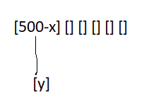

# Hashtable

Hashtable-da elementlər massivdə saxlanılır. Elementlərin massivdəki indeksləri isə hər bir elementin hash qiymətinə əsasən təyin olunur. Hər-hansı elementin hashtable-da olub olmadığı axtarıldıqda müvafiq elementin hashi hesablanır və daha sonra massivdə həmin hash-ə uyğun indeksə baxılır. Bu səbəbdən elementin hashtable-da olub olmadığını O(1) time-da bilinir. 

Burada söhbət kriptoqrafik hash-dan getmir. Hash qiymət numeric olmalıdır ki, massiv-də indeksin müəyyən olunması üçün istifadə edilə bilsin.

Massivlər fixed ölçüyə sahib olur. Hashtable daxilində n uzunluqlu massiv yaradılır, element daxil edildikdə həmin elementin hash-i hesablanır və massivin indeksi həmin hash olur. Daxil edilən element də həmin indeksə set olunur.  

```
add(element){
    hash = getHash(element)
    localArray[hash] = element
}
```
Sual yaranır. Daxil edilən elementin hash qiyməti massivin uzunluğundan böyük olarsa necə olacaq? Bu zaman eyni qaydada hash hesablanacaq, indeks isə hash-in massivin uzunluğuna olan nisbətindən qalan qalıq olacaq. Yəni uzunluğu 10 olan massivdə daxil edilən elementin hash-i 15 olarsa indeks 5 olacaq və element 5-ci indeksdə yerləşəcək.

```
add(element){
    hash = getHash(element)
    index = hash % localArray.Length
    localArray[index] = element
}
```

Sual yaranır. Əgər iki fərqli element üçün eyni hash hesablandıqda necə olacaq? Bundan da əlavə, daxil edilən x elementinin hash-i 1500 olsun. 1000 uzunluğu olan massivə əlavə edildikdə 500-cü indeksə yerləşəcək. Növbəti dəfə y elementi əlavə edilmək istənilərsə və onun orginal yəni qalıqsız hash-i 500 olarsa necə olacaq? İki fərqli element eyni indeksdə necə yerləşə bilər? Bu problem linkedlist ilə həll edilir. Artıq elementlər node obyekti kimi saxlanılır və hər bir node digərinə reference olur. Ümumiyyətlə hashtable-ın daxili massivində elementlər linkedlist formalaşdırmasa belə node şəklində saxlanılır. 



```
add(element){
    hash = getHash(element)
    index = hash % localArray.Length
    node = new Node(element);

    if(localArray[index]){
        node.NextNode = localArray[index]
        localArray[index] = node
    }
}
```

Massiv fixed ölçüyə sahib olduğuna görə hashtable-a elementlər əlavə olunduqda bir həddən sonra artıq massiv dolmuş olacaq və yeni əlavə edilən elementlər ancaq linkedlist şəklində saxlanılacaq (collusion).  Bu da axtarışın O(1) time-da yox O(n) time-da olmağına gətirib çıxarır. Hashtable-da elementlərin linkedlist şəklində saxlanılmağını minimuma endirmək üçün massiv resize edilir. Massivin 70%-i istifadə edildikdə massiv uzunluğu artırılır. Bu proses load factor adlanır. Fərz edək ki, 100 uzunluğu olan massivdə daxil edilən ədədlərdən birinin hash-i 54 digərinin hash-i 154-dür. Bu iki elementin indeksləri eyni olduğuna görə linkedlist formalaşdırırlar. Daha sonra massiv resize edilərək uzunluğu 200 olduqda hash-i 154 olan element yenidən hesablanır və öz orginal indeksinə yerləşəcək. 